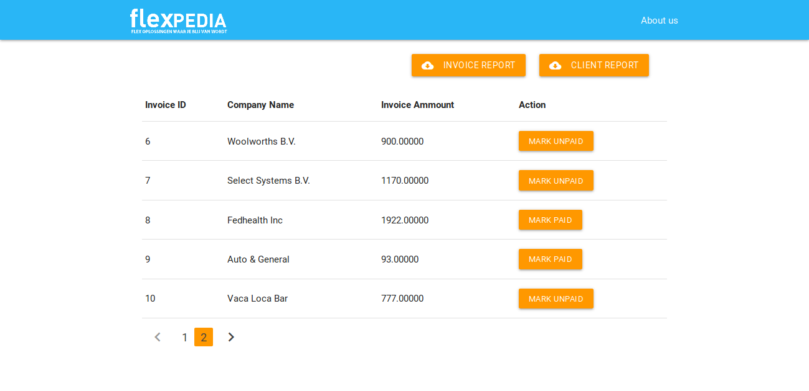

# FlexPedia Invoice UI
The repository is a sample project for FlexPedia group. It provides a PHP based UI for Invoice management. It is a Desktop as well as Mobile friendly UI.

# Getting started
It allows us to get below.
* Invoice reports
* Client report

### Invoice report
Gets invoice reports in system as CSV with below fields invoice id,company,amount

**Prerequisites:**
* invoices table is preloaded
* Database FLEXPEDIA


### Client report
Gets client reports in system as CSV with below fields invoice id,company,amount

**Prerequisites:**
* invoices table is preloaded
* Database FLEXPEDIA

How to run?
```
php -s localhost:5000
```

Invoice report:
```
http://localhost:5000/invoices.php
```

Client Reports:
```
http://localhost:5000/clients.php
```




## Author

* **Narendra Tripathi** 

## Built With

* [PHP 7](https://www.php.net/) - The programming lang
* [MaterializeCSS](https://materializecss.com/) - CSS Framework
* [ MySQL](https://www.mysql.com/) - Database

